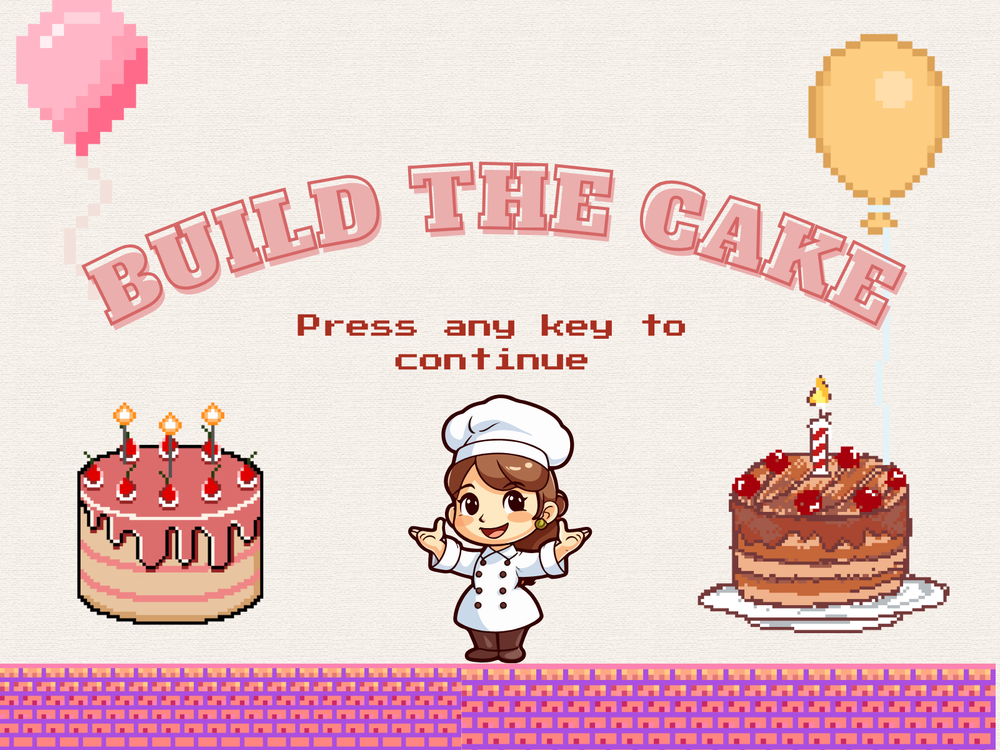
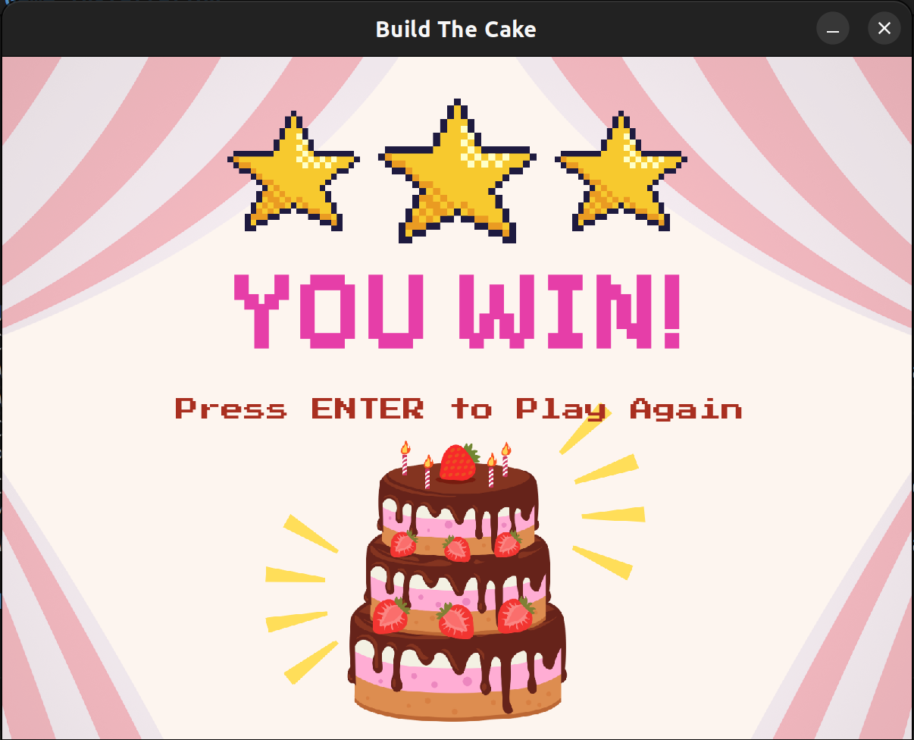

# Build The Cake

Welcome to "Build The Cake", a fun and interactive game built with Pygame!



## Prerequisites

Before playing the game, ensure that you have Python and Pygame installed on your machine. Follow the steps below:

### 1. Install Python

- **Windows:**
  - Download Python from [python.org](https://www.python.org/downloads/).
  - During installation, make sure to check the box that says "Add Python to PATH."

- **Linux:**
  - Use your package manager to install Python.
    ```bash
    sudo apt update
    sudo apt install python3
    ```

- **macOS:**
  - Python is usually pre-installed. If not, you can use [Homebrew](https://brew.sh/) to install it.
    ```bash
    brew install python
    ```

### 2. Install pip (if not already installed)

- **Windows:**
  - Python on Windows usually comes with `pip`. Open Command Prompt and run:
    ```bash
    pip --version
    ```

  - If `pip` is not installed, download `get-pip.py` from [https://bootstrap.pypa.io/get-pip.py](https://bootstrap.pypa.io/get-pip.py) and run:
    ```bash
    python get-pip.py
    ```

- **Linux:**
  - Most Linux distributions come with Python and `pip`. Verify with:
    ```bash
    python3 --version
    pip3 --version
    ```

- **macOS:**
  - Check Python and pip versions:
    ```bash
    python3 --version
    pip3 --version
    ```

## Game Installation

1. **Download the Repository:**
   Either download ZIP
    - Click the green "Code" button on the GitHub repository page.
    - Select "Download ZIP."
    - Extract the downloaded ZIP file to a location of your choice.
   Or clone the repo
    ```bash
    git clone git@github.com:khanhdo05/SEO-project.git
    ```

2. **Navigate to the Game Directory.**

3. **Install Pygame:**

    ```bash
    pip3 install pygame
    ```

4. **Run the Game:**

    ```bash
    python3 main.py
    ```

## How to Play

- Turn on sounds for an enhanced experience.
- Use the **left** and **right** arrow keys to move the player character.
- Catch the ingredients to BUILD THE CAKE!
- Avoid foul objects to prevent losing stars. Each foul object worth half a star.
- Avoid the snail to prevent losing 1 whole star and getting slowed down.
- Catch the soda can to enjoy a moment of speed up!
- Pause the game by pressing the **space** key.
- If you run out of stars (you have 5) or time (2 minutes), the game is over.
- You win when you reach 5 points and have at least 3 stars left. 
- When the game ends, click **ENTER** to play again or **ESC** / **Q** at any time to quit.



**Have fun playing "BUILD THE CAKE"!**
